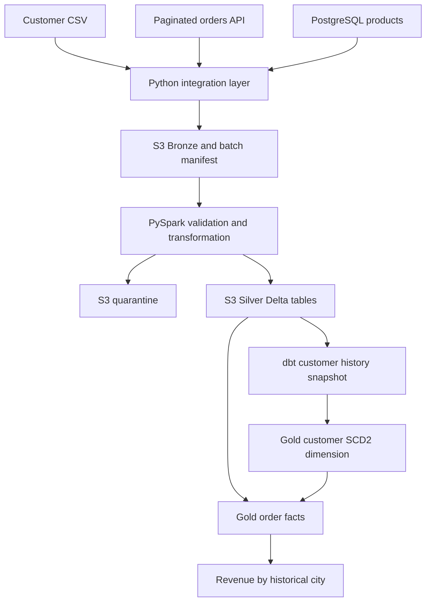

# Multi-source S3 lakehouse: PySpark + dbt SCD Type 2

A runnable portfolio project showing how separate operational sources become historical analytics tables.

**Business case:** customer details arrive as CSV, orders come from a REST API, and product reference data comes from PostgreSQL. Preserve customer history so an old order is attributed to the customer's city and tier **at order time**, not their current details.



## What is implemented

- CSV, same-origin paginated REST, and PostgreSQL extraction adapters.
- Immutable S3 objects with conditional writes, content hashes and a manifest published last.
- PySpark schema casting, email/city/tier normalization, invalid-record quarantine and deterministic latest-version selection.
- Silver Delta MERGE keyed by entity ID; stale updates and ambiguous equal-timestamp changes fail.
- Real dbt snapshots for SCD2 customer history, Gold dimension, order facts with temporal joins and a revenue aggregate.
- S3 bucket Terraform, Unity Catalog setup SQL, Databricks deployment bundle, CI and manually triggered cloud CD.
- Local demo using actual Spark plus dbt/DuckDB, with two batches and a snapshot-rerun assertion.

## Quick start: no cloud account needed

Requires Python 3.12 and Java 17. From repository root:

```bash
python -m venv .venv
source .venv/bin/activate
# Windows PowerShell: .venv\Scripts\Activate.ps1
python -m pip install -r requirements-local.txt
python -m pytest -q
python -m scripts.demo
```

The demo writes `.local/lake` and `.local/warehouse.duckdb`. It refuses to overwrite an existing demo database: move `.local` aside before a fresh demonstration. It does not delete previous results automatically.

| Stage | Batch 1 | Batch 2 |
|---|---|---|
| Customer C1 | Delhi / BASIC | Mumbai / GOLD |
| Gold C1 history | 1 current version | 1 closed + 1 current version |
| Order attribution | O1 → Delhi, 100.00 | O2 → Mumbai, 80.00 |
| Total customer history | 2 rows | 3 rows |

After the second batch, rerunning `dbt snapshot` must leave 3 history rows. Overall revenue is 180.00. One malformed customer and one invalid order are quarantined in batch 1.

## Cloud implementation

The deployed path is **AWS S3 + Databricks Spark/Delta + dbt-databricks**, not DuckDB. Silver external Delta tables and Gold managed Delta tables both reside in S3. The local DuckDB adapter is a test/demo substitute for the SQL engine, not a claim of cloud equivalence.

Read in this order:

1. [Source contracts](docs/SOURCES.md)
2. [AWS and Databricks setup](docs/SETUP.md)
3. [SCD2 semantics and example](docs/SCD2.md)
4. [CI/CD and operations](docs/CICD.md)
5. [Validation and limits](docs/VALIDATION.md)

## Repository layout

| Path | Purpose |
|---|---|
| `lakehouse/` | Connectors, landing protocol, shared Spark transformations |
| `scripts/` | Extraction CLI, local demo, cloud batch orchestration |
| `notebooks/silver.py` | Databricks Silver processing |
| `dbt/` | Sources, customer snapshot, Gold models and tests |
| `fixtures/` | Synthetic two-batch source samples |
| `infra/` | S3 Terraform, IAM examples and Unity Catalog SQL |
| `.github/workflows/` | Local CI and protected cloud deployment |

Self-directed portfolio project. Cloud execution needs your own credentials, approved permissions, existing Databricks workspace/compute and paid resources. No live customer data or production impact is claimed.
